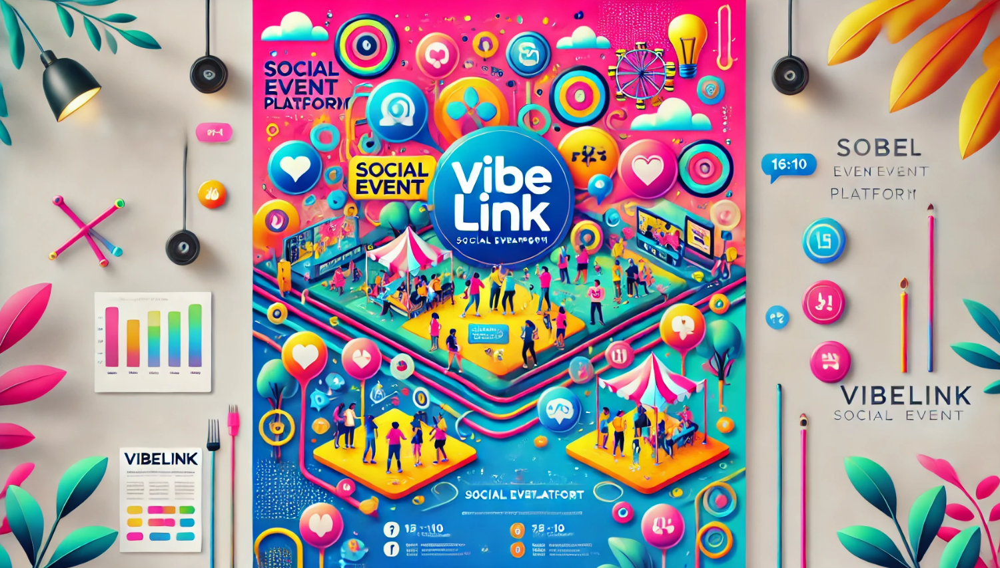

# VibeLink'e Hoşgeldin!
Bu web sitesi, kullanıcıların etkinlikler oluşturmasına, katılmasına ve sosyal bağlantılar kurmasına olanak tanır. Kullanıcılar, ilgi alanlarına göre farklı etkinlikler keşfeder ve topluluklarla etkileşimde bulunur. Hem fiziksel hem de çevrimiçi etkinlikler düzenlenebilir.

## Ana Özellikler

### Etkinlik Oluşturma
Kullanıcılar kolayca etkinlikler oluşturabilir, etkinlik adını, tarihini, saatini ve açıklamasını girerek katılımcıları davet edebilirler.

### Etkinlik Katılımı
Kullanıcılar, aktif etkinlikleri görüntüleyebilir ve katılmak istedikleri etkinliklere RSVP (katılım durumu) gönderebilirler.

### Sosyal Etkileşim
Etkinlikler hakkında yorum yapabilir, diğer katılımcılarla mesajlaşabilir ve sosyal bağlantılar kurabilirler.

### Filtreleme ve Arama
Kullanıcılar, etkinlikleri konum, tarih ve ilgi alanlarına göre filtreleyebilir.

### Kullanıcı Profili
Kullanıcılar, kendi profillerini oluşturabilir, geçmiş etkinliklerine göz atabilir ve katıldıkları etkinlikler hakkında geri bildirimde bulunabilirler.

## Kullanıcı Deneyimi

Site, kullanıcı dostu bir arayüze sahiptir. Etkinlikler arasında gezinmek, katılmak ve yeni insanlar tanımak son derece basittir. Hem bilgisayar hem de mobil cihazlar için uyumludur.

## Gelecekteki Özellikler

- Etkinliklerin canlı yayınları
- Özel etkinlikler için davetiyeler
- Etkinliklere özel anketler ve oylamalar
- Etkinliğe Katılanlar için oluşturulan QR Kod ile katılım zorunluluğu

Web sitemiz, insanları bir araya getirerek sosyal etkinliklerin keyfini çıkarmayı hedefliyor!
